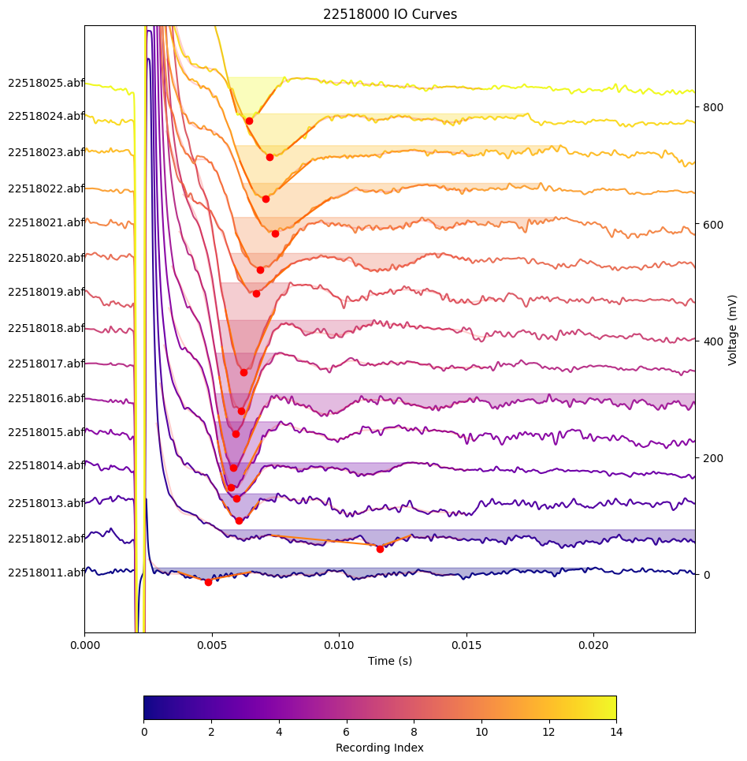

# Field Potential Analysis Pipeline

## Overview
This pipeline analyzes field excitatory postsynaptic potentials (fEPSPs) from electrophysiological recordings. The analysis focuses on extracting key measurements from fEPSP traces across different experimental protocols.

## Data Organization
The data is organized in the "LTP & I-O" folder, with subfolders named after the recording series (e.g., "22426000"). Each recording series contains the following protocol-specific subfolders:

- BL (Baseline)
- I-O (Input-Output)
- LTP (Long-Term Potentiation) - *not analyzed*
- Post LTP
- Post PP (Post Paired-Pulse)
- Pre PP (Pre Paired-Pulse)

## Measurements Extracted
For each fEPSP trace, the following measurements are calculated:

1. Slope of pre-trough fEPSP (30-80%)
2. Total slope of pre-trough fEPSP
3. Slope of post-trough fEPSP (30-80%)
4. Total fEPSP amplitude
5. Total fEPSP area

Note: The baseline for all measurements is taken from the plateau after the trough.

## Protocol-Specific Analysis
### Single fEPSP Protocols
The following protocols contain one fEPSP per trace:
- BL (Baseline)
- I-O (Input-Output)
- Post LTP

### Paired-Pulse Protocols
The following protocols contain two fEPSPs per trace, both of which are analyzed:
- Post PP
- Pre PP

## Output
The pipeline generates raw data measurements without additional figures. Each measurement is extracted according to standardized parameters to ensure consistency across all analyses.

## File Types
The folders may contain both data files and .jpg images. The .jpg files are not used in the analysis process.

## Example Plots

Examples are available in the `samples` folder.

